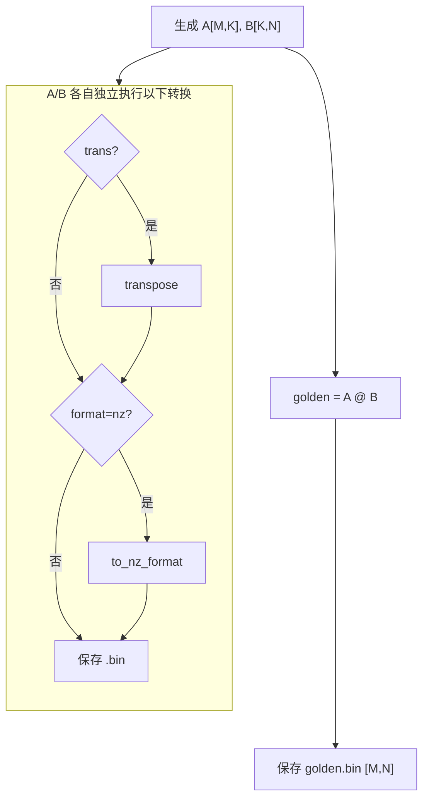

# Matmul Layout 与数据格式开发指南

本文覆盖 Matmul 算子所有 Layout 与数据格式相关的开发指导，包括 ND/DN/NZ/ZN 格式定义、
数据生成流程、LayoutPtn 选型、kernel 适配点和排障。

> **API 参考**：LayoutPattern 谱系、MakeFrameLayout 签名、Routing 表等 API 级内容详见 [`tensor_api_user_guide.md`](tensor_api_user_guide.md)。

## 1. 格式定义

NZ 是一种分形存储格式。对原始 tensor `(dim0, dim1)` ND 排布，NZ 格式的物理排列为 `(dim1/C0, dim0/16, 16, C0)`，
其中 `C0 = 32 / sizeof(dtype)`（fp16/bf16: C0=16, fp8/int8: C0=32, fp4: C0=64）。
非对齐时先补 0 到 16 对齐。

记矩阵计算的三个维度分别为 M、K、N（即 A[M,K] × B[K,N] = C[M,N]），则 A、B 矩阵的各种格式情况对应的 GM 数据排布及 LayoutPtn 如下。

**A 矩阵**

| transA | format | 物理排列 | LayoutPtn |
|--------|--------|---------|-----------|
| false | ND | (M, K) | `NDExtLayoutPtn` |
| false | NZ | (K/C0, M/16, 16, C0) | `NZLayoutPtn` |
| true | ND | (K, M) | `DNExtLayoutPtn` |
| true | NZ | (M/C0, K/16, 16, C0) | `ZNLayoutPtn` |

**B 矩阵**

| transB | format | 物理排列 | LayoutPtn |
|--------|--------|---------|-----------|
| false | ND | (K, N) | `NDExtLayoutPtn` |
| false | NZ | (N/C0, K/16, 16, C0) | `NZLayoutPtn` |
| true | ND | (N, K) | `DNExtLayoutPtn` |
| true | NZ | (K/C0, N/16, 16, C0) | `ZNLayoutPtn` |

## 2. 数据生成流程

随机数据生成固定以数学描述 A(M,K)、B(K,N) 生成，golden 计算固定为 A @ B。
数据生成后分两路：一路计算 golden 保存为 bin，另一路按 kernel 入参要求对 A、B 各自独立做转换后保存为 bin。



**转换函数**

```python
def to_nz_format(data, c0):
    """ND (dim0, dim1) → NZ 分形 (dim1/C0, dim0/16, 16, C0)

    c0 必须按 dtype 显式传入：fp16/bf16=16, int8/fp8=32, fp4=64
    """
    dim0, dim1 = data.shape
    dim0_pad = ((dim0 + 15) // 16) * 16
    dim1_pad = ((dim1 + c0 - 1) // c0) * c0
    padded = torch.zeros((dim0_pad, dim1_pad), dtype=data.dtype)
    padded[:dim0, :dim1] = data
    b_4d = padded.reshape(dim0_pad // 16, 16, dim1_pad // c0, c0)
    return b_4d.permute(2, 0, 1, 3).contiguous()
```

> **关键**：`permute(2, 0, 1, 3)` 产生物理排列 `(dim1/C0, dim0/16, 16, C0)`。
> 常见错误是写成 `permute(0, 2, 1, 3)` 产出 `(dim0/16, dim1/C0, 16, C0)`，
> 与 tensor_api NZ layout 的 stride 不匹配，导致全 FAIL。

> **注意**：`c0` 参数必须按 dtype 显式传入。不同 dtype 的 C0 不同（fp16/bf16=16, int8/fp8=32）。

**gen_data 范例**

```python
def gen_data(m, k, n, dtype=torch.int8, trans_a=False, trans_b=False, a_format="nd", b_format="nd"):
    C0 = 32 // torch.tensor([], dtype=dtype).element_size()  # 动态计算 C0

    # 生成原始数据（固定 shape）
    if dtype.is_floating_point:
        A = torch.randn(m, k, dtype=dtype)
        B = torch.randn(k, n, dtype=dtype)
    else:
        A = torch.randint(-128, 128, (m, k), dtype=dtype)
        B = torch.randint(-128, 128, (k, n), dtype=dtype)

    # golden 计算（固定 A @ B）
    golden = (A.float() @ B.float()).to(torch.bfloat16)

    # 按 kernel 需求转换 A（先 transpose，再 to_nz_format）
    if trans_a:
        A_for_kernel = A.T.contiguous()
    else:
        A_for_kernel = A
    if a_format == "nz":
        A_bin = to_nz_format(A_for_kernel, C0)
    else:
        A_bin = A_for_kernel

    # 按 kernel 需求转换 B（先 transpose，再 to_nz_format）
    if trans_b:
        B_for_kernel = B.T.contiguous()
    else:
        B_for_kernel = B
    if b_format == "nz":
        B_bin = to_nz_format(B_for_kernel, C0)
    else:
        B_bin = B_for_kernel
```

## 3. LayoutPtn 选择

Launcher 直接传 tensor_api pattern 作为模板参数：

| Pattern | 含义 | 构成 GM shape |
|---|---|---|
| `AscendC::Te::NDExtLayoutPtn` | 行主序（ND） | A: (M,K); B: (K,N); C: (M,N) |
| `AscendC::Te::DNExtLayoutPtn` | 列主序（DN） | A: (K,M); B: (N,K) |
| `AscendC::Te::NZLayoutPtn` | NZ 分形预重排 | A 或 B 离线重排为 NZ 格式 |
| `AscendC::Te::ZNLayoutPtn` | ZN 分形预重排 | A 或 B 离线重排为 ZN 格式（转置场景） |

`TagToTrans<Pattern>` 在 `layout_utils.h` 派生 transA/transB：

| Pattern | trans 值 |
|---|---|
| `NDExtLayoutPtn` | false |
| `DNExtLayoutPtn` | true |
| `NZLayoutPtn` | false |
| `ZNLayoutPtn` | true |

**常见错误**：新增 transA=true 但 launcher 里 layoutA 仍硬编码 NDExtLayoutPtn → 编译过但 ≈100% mismatch（K 维和 M 维错位）。

## 4. L1 layout 自动选择

使用 `L1LayoutHelper<LayoutPtn, Type, TransVal>` 统一处理：

- ND/DN 输入：L1 按 trans 标志选 NZ/ZN（走硬件 ND→NZ 格式转换）
- NZ/ZN 输入：L1 与 GM pattern 一致（走 NZ→NZ / ZN→ZN 块拷贝，省掉格式转换带宽）

```cpp
using MakeLayoutAL1 = typename L1LayoutHelper<LayoutA, AType, transA>::type;
using MakeLayoutBL1 = typename L1LayoutHelper<LayoutB, BType, transB>::type;
```

L1→L0A/L0B 的 routing 由 tensor_api 根据 DstPattern（L0A=NZ, L0B=ZN）和 SrcPattern（L1 的 pattern）
**自动派发** NORMAL 或 TRANS 模式，无需手动添加 `LoadDataTrait{transposed=true}`。

## 5. GM 端 layout 构造

GM 端 NZ layout 构造必须使用正确的 C0：

```cpp
// ⚠️ 关键：FrameLayoutFormat 默认 C0=16（基于 uint16_t），int8/fp8 需要 C0=32
static constexpr uint64_t A_C0 = 32 / sizeof(AType);
static constexpr uint64_t B_C0 = 32 / sizeof(BType);
using MakeLayoutA = AscendC::Te::FrameLayoutFormat<LayoutA, AscendC::Std::Int<A_C0>>;
using MakeLayoutB = AscendC::Te::FrameLayoutFormat<LayoutB, AscendC::Std::Int<B_C0>>;
```

> **⚠️ 致命陷阱**：`FrameLayoutFormat<NZLayoutPtn>` 默认使用 `LayoutTraitDefault<>`，其 C0 = 32/sizeof(uint16_t) = **16**。
> 当 AType/BType 为 int8 时，正确的 C0 应为 32/sizeof(int8_t) = **32**。
> C0 错误会导致 GM 端 NZ layout 的 Shape[Column][1]（列块数）和 Stride[Column][1]（列块间距）全部错误，
> `CopyGmToCbufAlignV2NZ` 读取错误的 blockCount/blockLen/srcStride，多 tile 场景全 FAIL。
> L1 端的 `L1LayoutHelper` 已正确按 dtype 计算 C0，此问题**仅影响 GM 端 layout 构造**。

## 6. Host 侧 size 计算

**ND 格式**：`size = dim0 * dim1 * sizeof(dtype)`

**NZ 格式**：buffer size 按物理维度计算：

```cpp
// CalcNzSize(dim0, dim1, c0): 分形物理排列的字节数
uint64_t dim0Blocks = (dim0 + 15) / 16;
uint64_t dim1Blocks = (dim1 + c0 - 1) / c0;
return dim1Blocks * dim0Blocks * 16 * c0 * sizeof(dtype);
```

按转换后的物理数据 shape 传入参数：

**A 矩阵**（golden 固定有 A[M,K]）

| transA | format | 物理数据 shape | CalcNzSize 参数 |
|--------|--------|--------------|----------------|
| false | NZ | (M, K) | `CalcNzSize(m, k, c0)` |
| true | NZ | (K, M) | `CalcNzSize(k, m, c0)` |

**B 矩阵**（golden 固定有 B[K,N]）

| transB | format | 物理数据 shape | CalcNzSize 参数 |
|--------|--------|--------------|----------------|
| false | NZ | (K, N) | `CalcNzSize(k, n, c0)` |
| true | NZ | (N, K) | `CalcNzSize(n, k, c0)` |

## 7. Kernel 端适配点（5 个）

**适配点 1 — `layout_utils.h`**：新增 NZ 的 `TagToTrans` 特化（`NZLayoutPtn` 和 `ZNLayoutPtn` 各一个）+ `IsNzOrZn` 检测 + `L1LayoutHelper` 辅助模板。

**适配点 2 — `matmul_kernel.h` / `matmul_kernel_fused.h`**：GM 端 layout 构造必须使用正确的 C0（详见 §5）。

**适配点 3 — `matmul_block_mmad.h`**：`MakeLayoutAL1` / `MakeLayoutBL1` 改用 `L1LayoutHelper`（详见 §4）。

**适配点 4 — `matmul_kernel.h`**：Slice 顺序——kernel 层做 M/N-slice（保留 fullK stride），block 层只做 K-slice：

```cpp
// Kernel 层：N-slice（保留 fullK stride，NZ column stride 依赖 fullK）
auto gmBlockB = gmB.Slice(Coord(0, nPos), Shape(fullK, tileN));
// Block 层：K-slice（gmBlockB 已经是 N-tile 大小）
auto gmTileB = gmB.Slice(Coord(kL1Offset, 0), Shape(curKL1, curN));
```

> **关键**：NZ 的 column stride = `C0 × ceil_align(K, 16)`，依赖 fullK。
> Slice 保留父 tensor 的 stride 不重算。如果 block 层同时切 K+N，
> `CopyGmToCbufAlignV2NZ` 用 sliced K 计算 `smallFractalSize`，但 stride 基于 fullK → 地址错位。

**适配点 5 — Launcher**：按 transA/transB + format 分发 LayoutPtn：

| transA | format | LayoutA | transB | format | LayoutB |
|--------|--------|---------|--------|--------|---------|
| false | nd | `NDExtLayoutPtn` | false | nd | `NDExtLayoutPtn` |
| true | nd | `DNExtLayoutPtn` | true | nd | `DNExtLayoutPtn` |
| false | nz | `NZLayoutPtn` | false | nz | `NZLayoutPtn` |
| true | nz | `ZNLayoutPtn` | true | nz | `ZNLayoutPtn` |

## 8. 排障速查

| 现象 | 根因 |
|------|------|
| ≈100% mismatch，仅 transA/B 某方向触发 | launcher 里 layout 硬编码未跟 trans 标志同步 |
| B-NZ 路径全错 | gen_data 未按 trans + format 规则转换（trans=true 时未做 transpose，format=nz 时未调 `to_nz_format`）；或 transpose 顺序错误（必须先 transpose 再 to_nz_format）；或 baseN 未 C0 对齐；或 `TagToTrans<NZLayoutPtn>` / `TagToTrans<ZNLayoutPtn>` 漏特化；或 c0 参数未按 dtype 传入 |
| NZ 输入 K≤16 PASS，K>16 + 多 N/M-tile FAIL | Slice 顺序错误——block 层同时切 K+N（或 K+M）导致 NZ column stride 不匹配。kernel 层必须先做 N/M-slice（保留 fullK stride），block 层只做 K-slice |
| NZ 输入全 FAIL（所有 shape） | gen_data NZ 排列顺序错误——应为 `permute(2,0,1,3)` 产出 `(dim1/C0, dim0/16, 16, C0)`，而非 `permute(0,2,1,3)` |
| NZ 输入多 tile FAIL，单 tile PASS | GM 端 `FrameLayoutFormat<NZLayoutPtn>` 使用默认 C0=16，但 int8/fp8 需要 C0=32。修复：`FrameLayoutFormat<NZLayoutPtn, Std::Int<32/sizeof(Type)>>` |
| NZ 输入文件大小不匹配 | Host 侧 sizeA/sizeB 按逻辑维度计算，应按 NZ 物理维度 `CalcNzSize(dim0, dim1, c0)` 计算 |
| NZ 输入非对齐 shape FAIL，对齐 shape PASS | tiling 引擎 baseM/baseN 未按 NZ 内轴/外轴约束对齐。NZ 格式要求外轴 16 对齐、内轴 C0 对齐。详见 §9 |

## 9. Tiling 对齐约束（NZ 场景）

NZ 格式的物理排列为 `(dim1/C0, dim0/16, 16, C0)`，其中：
- **外轴 dim0**：需要 16 元素对齐
- **内轴 dim1**：需要 C0 元素对齐（C0 = 32 / sizeof(dtype)）

**A 矩阵（NZ 格式）**

| transA | NZ of | 外轴(dim0→16) | 内轴(dim1→C0) |
|--------|-------|--------------|--------------|
| false | (M,K) | M | K |
| true | (K,M) | K | M |

**B 矩阵（NZ 格式）**

| transB | NZ of | 外轴(dim0→16) | 内轴(dim1→C0) |
|--------|-------|--------------|--------------|
| false | (K,N) | K | N |
| true | (N,K) | N | K |

**各轴约束**

| 轴 | 外轴场景（→16） | 内轴场景（→C0） | 约束 |
|----|---------------|----------------|------|
| baseM | A-NZ && transA=false | A-NZ && transA=true | `Align(baseM, isANz && transA ? C0 : 16)` |
| baseN | B-NZ && transB=true | B-NZ && transB=false | `Align(baseN, isBNz && !transB ? C0 : 16)` |
| baseK | A-NZ && transA=true；B-NZ && transB=false | A-NZ && transA=false；B-NZ && transB=true | `Align(baseK, ((isANz && !transA) || (isBNz && transB)) ? C0 : 16)` |

**Tiling 引擎代码**：

```cpp
constexpr uint64_t C0 = 32 / sizeof(AType);
runInfo_.baseM = Align(runInfo_.baseM, args_.isANz && args_.isATrans ? C0 : static_cast<uint64_t>(16));
runInfo_.baseN = Align(runInfo_.baseN, args_.isBNz && !args_.isBTrans ? C0 : static_cast<uint64_t>(16));
runInfo_.baseK = Align(runInfo_.baseK,
    (args_.isANz && !args_.isATrans) || (args_.isBNz && args_.isBTrans) ? C0 : static_cast<uint64_t>(16));
```

**常见错误**：用条件表达式（如 `if (isBTrans || !isATrans)`）控制 baseN 的 C0 对齐，在 transA=true+transB=false 时条件为 false，baseN 未对齐。此时 B 为 NZ of (K,N)，N 是内轴需要 C0 对齐，未对齐导致 `CopyGmToCbufAlignV2NZ` block copy 失败。对齐 shape（如 N=256）不受影响因为 N 本身已是 C0 的倍数。
