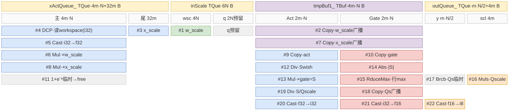

# 算子提炼模板 · 前两章(算子计算公式 + Kernel)

<!--
用法:复制本文,把每节正文(样例,取自 grouped_matmul_swiglu_quant_v2 A8W8)换成目标算子的内容;每节前的注释是指导(怎么填 + 纪律),写完可删可留。完整样例见 ops/grouped_matmul_swiglu_quant_v2-filled.md。

贯穿两章的严谨纪律:
1. 字节单位统一;每块子区字节相加 = 块总字节(逐块核对)。
2. 分配量 ≠ 实际数据:对齐冗余、预留未用都要标明。
3. 不张冠李戴:写清"读 workspace"还是"matmul 本身"等。
4. double buffer 是评估项,不是默认(看 InitBuffer 深度)。
5. 复用安全判据:同一子区相邻两次写之间须夹着对旧值的读。
6. 字节来源是 InitBuffer 公式,可追溯行号,不靠估。
7. 交代图/伪码的范围(哪一层循环、哪个域)。
8. 平实写法,不自造概念;引用源码用相对路径 + 行号。
-->

符号约定:`m`=ubFactorDimx(一趟 UB 处理的行/ token 数);`N`=中间全宽(若有 split,输出为 `N/2`);`m·N`=两者乘积(元素数),字节公式系数已含 dtype 字节(f32×4、int8×1)。

---

# 1. 算子计算公式

## 1.1 数学公式 / golden

<!--
目的:给出算子的数学定义,作为后续各节的依据。
要点:
- 写完整计算式;按算子说明是逐元素 / 逐行 / 归约 / 分块等。
- 定义每个维度符号;若含 split / scale / 量化等,写清各步的维度变化(输出维与输入维的关系)。
- 有 golden / 参考实现(如 tests 下的 executor 脚本),附其路径。
-->

```
C_i        = (X_i · W_i) ⊙ w_scale_i ⊙ x_scale_i      # int32 matmul → 反量化 fp32
C_act,gate = split_N(C_i)                              # 沿 N 对半,各 N/2
S_i        = Swish(C_act) ⊙ gate                       # Swish(x)=x/(1+e^-x)
Q_scale    = max(|S|)/127  (逐 token)  ;  Q = round(S/Q_scale)   # 输出 INT8
```

## 1.2 Shape · dtype 速查表

<!--
目的:列清输入/输出的形状契约。
来源:op_host 的 *_def.cpp(dtype/format 矩阵)、*_tiling.cpp 或 infershape(shape 约束与校验)。
要点:
- 每个输入/输出一行,给 shape、dtype、format。
- shape 约束(各维上限、对齐、整除等)单列,并附校验处文件:行号。
-->

| 张量 | shape | dtype | format |
|---|---|---|---|
| x / weight | [M,K] / [E,K,N] | int8 | ND / NZ |
| x_scale / weight_scale | [M] / [E,N] | float | ND |
| group_list | [E] | int64 | ND |
| y / y_scale | [M,N/2] / [M] | int8 / float | ND |

约束:N≤10240、x 尾轴<65536;groupListType 0=cumsum/1=count。

## 1.3 计算图分解(AscendC API 接口)

<!--
目的:把数学式落成实际调用的 AscendC API 序列。
要点:
- 按引擎分段:cube 段 / cube 结果到 vector 的搬运 / vector 段。
- 每步写真实 API 接口签名(含关键参数),不写数学伪名。
- 区分高层整 tensor API 与寄存器级 MicroAPI(按目标平台选其一)。
- 无现成复合 API 的运算,用基本 API 手工展开,逐步列出。
-->

| 步 | 数学 | AscendC API 接口 |
|---|---|---|
| matmul | X·W→i32 | `mm.SetTensorA/B` / `mm.IterateAll<false>(workspaceGm[off])` |
| 反量化 | i32→f32 ⊙w ⊙x | `Cast(dst,src,RoundMode::CAST_NONE,count)` → `Mul(dst,wScale,src,count)` → `Mul(dst,xScale,src,count)` |
| split | 拆 act/gate | `Copy<float,false>(dst,src[actOffset/gateOffset],MASK_PLACEHOLDER,proDimsx,{…})` |
| Swish | x/(1+e⁻ˣ)⊙gate | `Muls(-1)`→`Exp`→`Adds(1)`→`Div(act,act,·)`→`Mul(act,gate,act)` |
| 量化 | abs(S)→max→/127→S/Qs→i8 | `Abs`→`WholeReduceMax(…,ReduceOrder::ORDER_ONLY_VALUE)`→`Muls(·,1/127)`→`Brcb`→`Div`→`Cast(CAST_RINT→CAST_ROUND→CAST_TRUNC)` |

## 1.4 计算特征总结

<!--
目的:一张表概括决定第 2 章循环与内存形态的要素。
要点(逐项填):轴含义;各轴切分方式;引擎配比(AIC:AIV);cube↔vector 数据交接方式;执行遍数(单遍 / 多遍)。
-->

| 项 | 内容 |
|---|---|
| 轴含义 | M=总 token(按 groupList 分专家);K=reduce;N=中间全宽(act+gate);E=专家数 |
| 切分 | Cube:M×N 分 baseM×baseN,cubeBlockDim 跨核,K 核内,分组沿 M;Vector:按行分 vectorBlockDim 核,核内 ubFactorDimx 行/趟 |
| 引擎 | MIX 1:2,AIC 只做 matmul→workspace,AIV 反量化/swiglu/量化 |
| 数据交接 | Cube→GM workspace(i32)→Vector,CrossCore flag + SyncAll |
| 执行遍数 | 一遍 vector(整行 N/2 在 UB 内 ReduceMax) |

---

# 2. Kernel

## 2.1 Cube 与 Vector 的协作(经 GM workspace)

<!--
目的:讲清 cube 与 vector 两域如何经中转 buffer 配合(本章其余节的前提)。
按数据流串讲,逐点只说一件事,整体流程交给末尾伪码:
  ① 原始输入 shape;
  ② cube 怎么切块、跨核分发;
  ③ 中转 buffer(形状 = 完整 cube 输出、dtype);
  ④ vector 怎么从中转 buffer 切块读;
  ⑤ 两域同步(轮次 / flag)及读取完整性的保证。
要点:shape 用元素数(字节在 §2.2.2);两侧切分粒度可不同,需说清靠哪个轴对齐;标签直接命名内容。
-->

① **原始 shape**:x `[M,K]`、weight `[E,K,N]`(int8);groupList 把 M 分成 E 个专家段,第 i 段算 `X_i[m_i,K] · W_i[K,N]`,Σmᵢ=M。N 为中间全宽,后续 split 成 act/gate 各 N/2。

② **cube tile**:每段的 `[m_i, N]` 结果按 `baseM×baseN` 切成 basicBlock(K 在核内迭代),basicBlock 跨 `cubeBlockDim` 个 AIC 核分发;总块数 `Σ_i ⌈m_i/baseM⌉×⌈N/baseN⌉`,输出 int32。

③ **workspace**:所有 basicBlock 写进一块 GM workspace,形状 `[M,N]` int32 —— 即完整(未切分)matmul 输出,是 cube↔vector 唯一中转(不占 UB);block 落点 `[mOff:+baseM, nOff:+baseN]`。

④ **vector tile**:从 workspace 按行消费 —— 每 group 的 calcCount 行先按 `vectorBlockDim` 分核,本核再按 `ubFactorDimx` 行分 `ubDimxLoop` 趟,每趟读 `[ubFactorDimx, N]`(整行 N;因随后要 split 并对整行 ReduceMax)。cube 的 M 粒度 `baseM` 与 vector 的 `ubFactorDimx` 独立,靠 workspace 行主布局在 M 轴对上。

⑤ **同步**:cube/vector 共用 `syncId`/`totalSyncTimes` 轮次。整行读的正确性 = 一行 N 的 `⌈N/baseN⌉` 个 block 编号连续 + 两侧同轮次递推使每轮完成整数个整行块 + `SetFlag(0x8, PIPE_FIX)` 保证写回完成;另每 `VC_SYNC_MAX_TIMES=14` 轮 vector 置 `0x9`、cube `WaitFlag(0x9)` 阻塞防覆盖。

**流程**(①~⑤ 串接):

```text
# ① x[M,K] · weight[E,K,N];groupList→E 段;每段 X_i[m_i,K]·W_i[K,N];N=act+gate 全宽

AIC ── CubeProcess:                                      # ②
  for basicBlock in 全部(跨 cubeBlockDim 核):
      mmad  X_i_blk[baseM,K] · W_i_blk[K,baseN] → int32   #   K 核内迭代
      写 workspace[mOff:+baseM, nOff:+baseN]              # ③ workspace[M,N] int32 = 完整输出
  每轮末: CrossCoreSetFlag(0x8, PIPE_FIX)                 # ⑤ 通知 vector(写回已完成)
                                                          #    每 14 轮 CrossCoreWaitFlag(0x9)

AIV ── VectorProcess(syncId 轮次与 cube 对齐):            # ④
  for group:
    WaitFlag(0x8) + SyncAll                               # ⑤ 等本轮整行写完
    calcCount 行 / vectorBlockDim 核 / 每核 ubFactorDimx 行:
      for loopIdx in ubDimxLoop:
        读 workspace[row:+ubFactorDimx, 0:N]              # ④ 整行 N
        反量化 / swiglu / 量化(见 §2.2.3)
        写 y[row:+ubFactorDimx, 0:N/2]
    每 14 轮: CrossCoreSetFlag(0x9)                        # ⑤ 反向,防 cube 覆盖
```

## 2.2 Vector Tile 循环与内存分配

### 2.2.1 UBuf 内存布局(block-beta)

<!--
目的:画出 vector 段 UB 上各 buffer 的布局与复用。用 block-beta(不用 SVG)。
画法:
- 第一行块头:每块标 TQue/TBuf + 总字节(宽度只粗略区分大小,声明非比例,等大块画等宽)。
- 第二行:按偏移把块切子区(含 ReinterpretCast / 头尾分区 / 不同 dtype 视图),标子区字节。
- 其下:按调用序纵向叠放,框内「#n · API · 语义」;同一子区叠多框即复用。
- #n 与 §2.2.3 操作数代入同号。
-->



复用序(同子区自上而下):
1. 主区 `#4→5→6→8→11`;
2. Act `#2→7→9→12→13→19→20`;
3. Gate `#2→7→10→14→15→18→21`;
4. out:scl=y_scale(`#16` 保留)、y=int8(`#17` 临时→`#22` 覆盖)。

> 说明:`#4` 是读 cube workspace(非 matmul);尾 32m 含对齐冗余(x_scale 实为 m 个 float);inScale 的 quant 2N 本路径仅预留。

### 2.2.2 UB 总占用与切分约束

<!--
目的:由各 buffer 的 InitBuffer 实参求 UB 总占用,并反推切分上界。
步骤:
  1. 逐块按 InitBuffer 公式写出字节;子区字节相加须 = 块总字节(核对)。
  2. 各块相加成总公式。
  3. 由「总 ≤ UB_SIZE」反推一趟 tile 大小。
要点:说明是否开 double buffer 及原因;常量项(如对齐/保留余量)如实标来源,不臆测推导。
-->

```
总 = (4m·N+32m) + 6N + 4m·N + (m·N/2+4m+192)
   = 8.5·m·N + 36·m + 6·N + 192   字节
```

主项 `8.5·m·N`:两块 f32 主占用块(xActQueue_主区 4m·N + tmpBuf1_ 4m·N)+ outQueue_ 的 int8 y(0.5m·N)。`192` = `RESRERVE_MEM_SIZE` 常量(只加在 outQueue_,作 scaleOut 对齐保留余量;源码未注释取值依据)。约束 `8.5·m·N + 36m + 6N + 192 ≤ UB_SIZE`,host 据此反推 `ubFactorDimx`;depth=1 不开 double buffer,以在此约束下容纳更大 tile。

### 2.2.3 内存复用与计算过程

<!--
目的:把 §2.1 内层循环体逐 API 展开,贯通「循环 / 数据拷贝 / 计算 / 内存复用」四者。
步骤:
  1. 先写「派生」:各 LocalTensor 由哪块 Alloc / ReinterpretCast / 偏移得到。
  2. 按真实调用序逐行写,前缀 /* #n */、行末标 [类型] + 写入子区;#n 唯一(连续同 buffer 原地链合并为一个号),与 §2.2.1 图同号。
  3. 如实保留循环结构(if 缓存 / 循环体缩进)。
标签:[入] GM→UB · [出] UB→GM · [移] UB 内拷贝/广播 · [算] 向量计算。
-->

派生:`xLocalF32`=xActLocal.ReinterpretCast<float>()(同 buf 原地);`activationScaleLocal`=xActLocalF32[m·N];`tmpUbF32Act/Gate`=tmpUbF32 / tmpUbF32[ubFactorDimy·proDimsx];`scaleOut`=outLocal[off]、`yOut`=outLocal.ReinterpretCast<int8>()。

本段 = `ProcessDSQ` 体(每 group 调一次)。本段内只有一重循环 `ubDimxLoop`(`#2~#24` 每趟);`#1` 是 `if` 缓存载入(w_scale 整组复用,非循环)。group 那重循环在本段之外(见 §2.1 循环嵌套)。标签:`[入]`GM→UB 搬入 · `[出]`UB→GM 搬出 · `[移]`UB 内拷贝/广播 · `[算]`向量计算;行末 `→子区(覆盖#k)` 是内存复用。这段把循环 × 数据拷贝(入/出/移)× 计算(算)× 复用(同子区被多步写)。

```cpp
// ── if 缓存(非循环):w_scale 仅 group 变化时载入,整组复用;ProcessDSQ 每 group 调一次 ──
if (weightCacheGroupId_ != groupId) {
  /* #1 */ DataCopyPad(inScaleLocal, weightScaleGm, ...);   // [入] w_scale GM→UB·inScale(整组复用)
           weightCacheGroupId_ = groupId;
}
// ── 唯一循环:ubDimxLoop,每趟 ubFactorDimx 行 ──
for (loopIdx = 0; loopIdx < ubDimxLoop; ++loopIdx) {
  /* #2 */ Copy(tmpUbF32, weightScaleLocal, ...);           // [移] w_scale 广播 → tmpBuf1_(全)
  /* #3 */ DataCopyPad(xActLocalF32[m·N], activateScaleGm,...); // [入] x_scale → xAct·尾
  /* #4 */ DataCopyPad(xActLocal, workspaceGm, ...);        // [入] cube i32 → xAct·主
  /* #5 */ Cast(xLocalF32, xLocal, CAST_NONE, count);       // [算] i32→f32 原地 → xAct·主
  /* #6 */ Mul(xLocalF32, tmpUbF32, xLocalF32, count);      // [算] ×w_scale → xAct·主
  /* #7 */ Copy(tmpUbF32, activationScaleLocal, ...);       // [移] x_scale 广播 → tmpBuf1_(覆盖#2)
  /* #8 */ Mul(xLocalF32, tmpUbF32, xLocalF32, count);      // [算] ×x_scale(反量化完成)
  /* #9 */ Copy(tmpUbF32Act,  xLocalF32[actOffset],  ...);  // [移] act → Act
  /* #10*/ Copy(tmpUbF32Gate, xLocalF32[gateOffset], ...);  // [移] gate → Gate
  /* #11*/ Muls(xLocalF32,tmpUbF32Act,-1f); Exp(..); Adds(..,1f); // [算] 1+e⁻ˣ 借 xAct·主
  /* #12*/ Div(tmpUbF32Act, tmpUbF32Act, xLocalF32, ..);    // [算] Swish → Act
           xActQueue_.FreeTensor(xActLocal);
  /* #13*/ Mul(tmpUbF32Act, tmpUbF32Gate, tmpUbF32Act, ..); // [算] ×gate=S → Act
  /* #14*/ Abs(tmpUbF32Gate, tmpUbF32Act, ..);              // [算] abs(S) → Gate
  /* #15*/ WholeReduceMax(tmpUbF32Gate, tmpUbF32Gate, ..);  // [算] 行max → Gate
  /* #16*/ Muls(scaleOut, tmpUbF32Gate, 1/127, ..);         // [算] Q_scale → out·scl(保留)
  /* #17*/ Brcb(outLocal, scaleOut, ..);                    // [移] 广播临时 → out·y
  /* #18*/ Copy(tmpUbF32Gate, outLocal, ..);                // [移] 广播值写回 → Gate
  /* #19*/ Div(tmpUbF32Act, tmpUbF32Act, tmpUbF32Gate, ..); // [算] S/Q_scale → Act
  /* #20*/ Cast(tmpUbF32ActI32, tmpUbF32Act, CAST_RINT,..); // [算] f32→i32 原地 → Act
  /* #21*/ Cast(tmpUbF32Gate16, tmpUbF32ActI32, CAST_ROUND,..); // [算] i32→f16 → Gate
  /* #22*/ Cast(yOut, tmpUbF32Gate16, CAST_TRUNC, ..);      // [算] f16→i8 → out·y(覆盖#17)
  /* #23*/ DataCopyPad(scaleGm_, scaleOut, ..);             // [出] y_scale → GM
  /* #24*/ DataCopyPad(yGm_, yOut, ..);                     // [出] y → GM
}
```

本段一重循环(`ubDimxLoop`,`#2~#24` 每趟);`#1` 是 `if` 缓存载入(每 group 一次、非循环,在循环外);group 那重循环在 §2.1。`#n` 与 §2.2.1 图同号:据行末"→ 子区"对照图,核复用安全(同一子区相邻两次写之间须夹着对旧值的读)。

---

# 3. Tiling

<!--
目的:列清第 2 章用到的每个 tiling 参数及其计算方式。
来源:host tiling —— 解析 shape/attr 的函数 + 填 TilingData 的函数(op_host/op_tiling 下)。
步骤:
  1. 逐参数列「含义·第2章用处 | 计算方式」;固定值写常量,派生值写公式(由 shape / attr / 平台核数等算出)。
  2. 表后补:matmul tiling 的产生与覆盖关系、核数下发(SetBlockDim)、workspace 计算、tilingKey 分发。
-->

逐参数给出含义、第 2 章用处与计算方式:

| 参数 | 含义 · 第 2 章用处 | 计算方式 |
|---|---|---|
| `M` / `K` | 总 token / reduce 维(§2.1①③、§2.2.2) | `M = x.dim0`;`K = x.dim1` |
| `N` | 中间全宽(§2.1①③、§2.2) | single(W 为 5D):`N = W.dim1 · W.dim4`;multi(W 为 4D):`N = W.dim0 · W.dim3` |
| `groupNum`(E) | 专家数(§2.1 分组) | `groupNum = groupList.dim0` |
| `groupListType` | groupList 编码 0=cumsum/1=count(§2.1 分组) | `= attr(0/1)` |
| `isSingleTensor` | weight 单/多 tensor 布局(§2.2.3 取址) | `W.dimNum==5 → 1`;`==4 → 0` |
| `ubFactorDimx` | vector 每趟行数(§2.1④、§2.2,即 §2.2 的 `m`) | `N<4600 → 4`;`4600≤N<8192 → 2`;`else → 1` |
| `ubFactorDimy` | vector 子区宽(§2.2 内存子区) | `ubFactorDimy = N / 2` |
| `cubeBlockDim` / `vectorBlockDim` | AIC / AIV 核数(§2.1② 跨核、④ 分核) | `GetCoreNumAic()` / `GetCoreNumAiv()`(无 platformInfo 时取 compileInfo) |
| `baseM` / `baseN` / `baseK` | cube tile(§2.1② cube tile) | 常量 `128` / `256` / `128` |
| `stepKa/Kb`、`depthA1/B1`、`stepM/N`、`dbL0C` | cube L1 搬运步长 / 双缓冲(§2.1② K 核内迭代) | 常量:`stepKa=stepKb=4`,`depthA1=depthB1=8`(=2×stepK),`stepM=stepN=1`,`dbL0C=1` |

补充:
- `ubFactorDimx` 分档的依据:每行 N 个元素,UB 占用 ∝N,故 N 越大、一趟能放的行数越少 —— 按 N 反比分三档取 4/2/1。
- matmul tiling(`matmulTiling`):先以 `SetShape(M, baseN, K)`、`SetOrgShape(M, N, K)` 调 `MatmulApiTiling.GetTiling` 得 L1 等字段,再用上表 `baseM/baseN/baseK`、`stepK*`、`depth*` 常量覆盖关键项。
- 下发(`PostTiling`):`SetBlockDim(aicCoreNum)`;workspace = `M·N·sizeof(int32)`(`[M,N]` int32 中转,= §2.1③)`+ 20MB`(`EXTEND_WORKSPACE_SIZE`,系统/扩展余量);tilingKey = `A8W8_FUSION_KEY_MODE`(=3)→ 分发到 `GroupedMatmulDequantSwigluQuantFusion`(key 2/4/5 = A8W4/A4W4,走不同 pipeline)。
