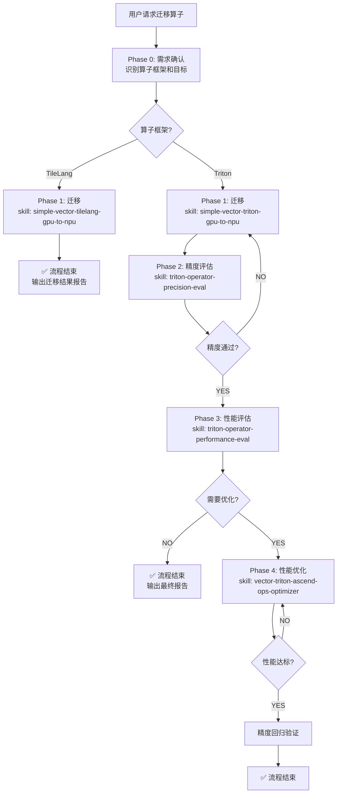

# 简单 Vector 类算子 GPU→NPU 迁移与优化工作流

本 Skill 是一个**工作流编排器**，负责串联迁移、评估、优化等子 Skill，指导完成算子从 GPU 到昇腾 NPU 的端到端交付。

## 核心原则

- **你是编排者，不是执行者**：每个阶段的具体工作由对应的子 Skill 完成，你负责判断何时调用哪个 Skill、传递什么上下文、以及根据结果决定下一步。
- **正确性优先于性能**：迁移后必须先通过精度验证，再考虑性能优化。
- **数据驱动决策**：所有"是否需要优化"的判断必须基于评估数据，不凭直觉。

## 适用范围

| 算子框架 | 支持的流程 | 原因 |
|----------|-----------|------|
| **Triton** | 迁移 → 精度评估 → 性能评估 → 性能优化 | 具备完整的子 Skill 链 |
| **TileLang** | 仅迁移 | 目前无性能优化 Skill |

**⚠️ 仅支持简单 Vector 类算子**（不涉及 Cube Core 的纯向量计算算子）。

## 工作流总览



## Phase 0: 需求确认

**目标**：明确算子类型、源代码位置、性能目标。

**必须向用户确认的信息：**

1. **算子框架**：Triton 还是 TileLang？
2. **源代码位置**：GPU 算子源文件路径
3. **性能目标**（仅 Triton）：是否有明确的性能提升倍数要求？如果用户给了gpu侧的性能，应和gpu性能差距不要太大，性能控制在同一个数量级以内是底线。如果没有，**必须要向用户询问！！**，如果没有回复，默认目标为"精度通过即可"
4. **环境确认**：NPU 开发环境是否就绪？（npu-smi info）

**决策逻辑：**

```
IF 算子框架 == TileLang:
    → 进入 TileLang 路径（仅 Phase 1）
ELIF 算子框架 == Triton:
    → 进入 Triton 路径（Phase 1-4）
ELSE:
    → 询问用户确认框架类型
```

---

## Phase 1: 迁移

### Triton 路径

**调用 Skill**：`simple-vector-triton-gpu-to-npu`

**传递上下文**：
- GPU 算子源代码路径
- 算子功能描述（如有）

**阶段产出**：

- NPU 版本的 Triton 算子代码
- 基础运行测试结果（能否跑通）

**检查点 1 — 迁移基础验证**：

- ✅ 代码能编译通过 → 进入 Phase 2
- ❌ 编译失败 → 在 Phase 1 内继续调试（由迁移 Skill 处理）
- ❌ 算子不在支持范围内 → 报告用户，终止流程

### TileLang 路径

**调用 Skill**：`simple-vector-tilelang-gpu-to-npu`

**传递上下文**：

- GPU 算子源代码路径

**阶段产出**：

- NPU 版本的 TileLang 算子代码
- 精度验证结果（TileLang 迁移 Skill 内置了精度验证）

**检查点 — TileLang 最终验证**：
- ✅ 精度验证通过 → **流程结束**，输出迁移完成报告
- ❌ 精度验证失败 → 在 Phase 1 内继续调试（由迁移 Skill 处理）
- ❌ 算子不可迁移 → 报告用户，终止流程

**⚠️ TileLang 路径到此结束**，以下阶段仅适用于 Triton。

---

## Phase 2: 精度评估（仅 Triton）

**调用 Skill**：`triton-operator-precision-eval`

**传递上下文**：
- Phase 1 产出的 NPU Triton 算子代码
- 对应的 PyTorch 参考实现（用于精度比对）
- 测试数据类型和形状配置

**阶段产出**：
- 精度验证报告（含 MERE、MARE 等指标）
- 各数据类型的通过/失败状态

**检查点 2 — 精度达标判定**：

| 判定结果 | 条件 | 下一步 |
|---------|------|--------|
| ✅ 通过 | 所有数据类型精度在阈值内 | → Phase 3 |
| ❌ 失败 | 存在数据类型精度超标 | → 回到 Phase 1 修复 |

**精度阈值参考**：
- float16/bfloat16：rtol=1e-3, atol=1e-3
- float32：rtol=1e-4, atol=1e-4
- 整数类型：完全相等

**回退策略**：如果精度失败，将错误信息和精度报告传回 Phase 1 的迁移 Skill，要求其修复。最多回退 **3 次**，超过则报告用户介入。

---

## Phase 3: 性能评估（仅 Triton）

**调用 Skill**：`triton-operator-performance-eval`

**前置条件**：Phase 2 精度验证已通过。

**传递上下文**：

- NPU Triton 算子代码路径
- 算子名称（用于 `--kernel-name`）
- 测试输入规模（生产级别的 shape）

**阶段产出**：
- 性能评估报告（耗时、带宽利用率、瓶颈类型）
- 基线性能数据

**检查点 3 — 是否需要优化**：

| 判定结果 | 条件 | 下一步 |
|---------|------|--------|
| ✅ 性能满足要求 | 用户无明确性能目标，或已达到目标倍数 | → **流程结束** |
| ⚠️ 需要优化 | 用户有明确性能目标且未达到 | → Phase 4 |
| ⚠️ 建议优化 | 性能评估发现明显瓶颈，有优化空间 | → 询问用户是否进入 Phase 4 |

**决策逻辑**：
```
IF 用户指定了性能目标 AND 当前性能未达标:
    → 必须进入 Phase 4
ELIF 性能评估发现明显优化空间（利用率 < 30%）:
    → 向用户建议优化，等待确认
ELSE:
    → 流程结束，输出报告
```

---

## Phase 4: 性能优化（仅 Triton，循环迭代）

**调用 Skill**：`vector-triton-ascend-ops-optimizer`

**前置条件**：
- Phase 2 精度已通过
- Phase 3 已建立性能基线
- 有明确的性能优化目标

**传递上下文**：
- NPU Triton 算子代码路径
- 性能基线数据（Phase 3 产出）
- 性能优化目标（x 倍提升）
- Phase 3 的瓶颈诊断结果

**阶段产出**：
- 优化后的算子代码
- 优化结果报告（基线 vs 优化后对比）

**循环退出条件**：

优化 Skill 内部会自行迭代直到达标。当优化 Skill 返回结果后：

| 判定结果 | 条件 | 下一步 |
|---------|------|--------|
| ✅ 达标 | 性能提升达到目标倍数 | → 精度回归验证 → 流程结束 |
| ❌ 未达标 | 优化 Skill 报告无法继续提升 | → 报告用户当前最佳结果 |

**⚠️ 优化后必须回归精度验证**：调用 `triton-operator-precision-eval` 确认优化未破坏正确性。如果精度回归失败，需要在优化 Skill 中回退到精度正确的版本。

---

## 流程结束：输出最终报告

无论从哪个阶段结束，都必须输出结构化的最终报告：

```markdown
## 算子迁移与优化报告

### 基本信息
| 项目 | 值 |
|------|-----|
| 算子名称 | {op_name} |
| 算子框架 | {Triton / TileLang} |
| 源文件 | {gpu_source_path} |
| 目标文件 | {npu_output_path} |

### 完成阶段
- [x] Phase 1: 迁移
- [x/空] Phase 2: 精度评估
- [x/空] Phase 3: 性能评估
- [x/空] Phase 4: 性能优化

### 精度结果（如适用）
| 数据类型 | MERE | MARE | 结果 |
|---------|------|------|------|
| float16 | ... | ... | PASS/FAIL |
| float32 | ... | ... | PASS/FAIL |

### 性能结果（如适用）
| 指标 | 基线 | 优化后 | 提升 |
|------|------|--------|------|
| 耗时 (us) | ... | ... | ...x |
| 瓶颈类型 | ... | ... | - |

### 遗留问题（如有）
- ...
```

---

## 异常处理

| 异常场景 | 处理方式 |
|---------|---------|
| 算子不在支持范围（非简单 Vector 类） | 立即告知用户，建议使用其他 Skill（如 ascendc-operator-dev） |
| 环境未就绪 | 引导用户先配置环境（建议使用 cann-installer 或 ascend-docker Skill） |
| 精度反复失败（>3 次回退） | 停止自动修复，向用户报告问题详情，请求人工介入 |
| 性能优化无法达标 | 报告当前最佳结果和瓶颈分析，由用户决定是否接受 |
| 用户中途变更需求 | 重新执行 Phase 0 需求确认 |

## 子 Skill 调用清单

| 阶段 | Skill 名称 | 触发条件 |
|------|-----------|---------|
| Phase 1 (Triton) | `simple-vector-triton-gpu-to-npu` | 算子框架为 Triton |
| Phase 1 (TileLang) | `simple-vector-tilelang-gpu-to-npu` | 算子框架为 TileLang |
| Phase 2 | `triton-operator-precision-eval` | Triton 迁移完成后 |
| Phase 3 | `triton-operator-performance-eval` | 精度验证通过后 |
| Phase 4 | `vector-triton-ascend-ops-optimizer` | 需要性能优化时 |
| 精度回归 | `triton-operator-precision-eval` | 优化完成后回归验证 |

## 禁止事项

- **NEVER** 跳过精度评估直接进入性能优化
- **NEVER** 在精度未通过时进行性能评估（无意义）
- **NEVER** 对 TileLang 算子尝试性能优化（无对应 Skill）
- **NEVER** 在没有性能基线的情况下开始优化
- **NEVER** 优化后不做精度回归验证
- **NEVER** 自行实现子 Skill 的功能——必须调用对应 Skill
